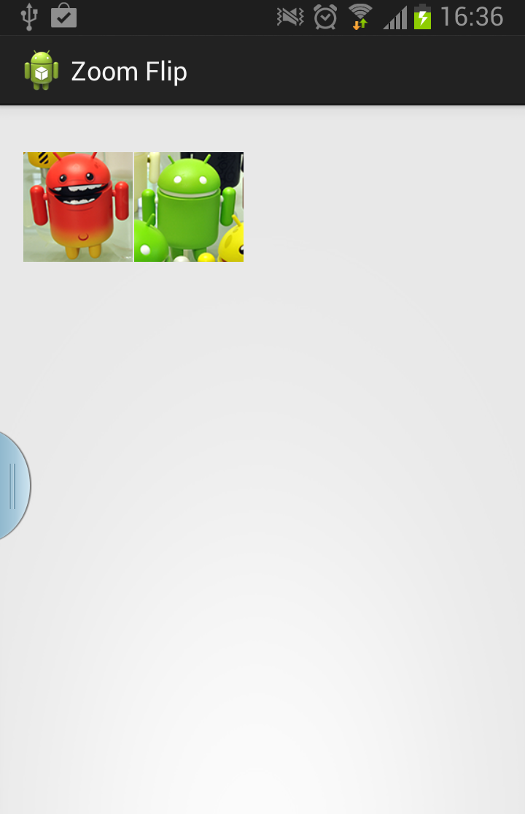
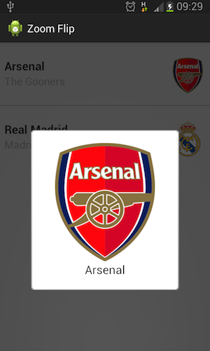

ZoomFlipFragmentTransition
==========================

An android custom view which looks like the music/movie pop up transition in Path.





Usage
========================

Layout

```xml
<FrameLayout xmlns:android="http://schemas.android.com/apk/res/android"
    xmlns:tools="http://schemas.android.com/tools"
    android:id="@+id/container"
    android:layout_width="match_parent"
    android:layout_height="match_parent"
    android:orientation="vertical" >

   <!-- ......
        Your layout for thumb
        .....
   -->

    <RelativeLayout
        android:id="@+id/overlay"
        android:layout_width="match_parent"
        android:layout_height="match_parent"
        android:layout_gravity="bottom"
        android:background="#AA000000"
        android:clickable="true"
        android:gravity="bottom"
        android:visibility="gone" />

    <RelativeLayout
        android:id="@+id/main"
        android:layout_width="match_parent"
        android:layout_height="match_parent"
        android:gravity="center"
        android:visibility="invisible" />

</FrameLayout>

```

Activity

```java
  @Override
	protected void onCreate(Bundle savedInstanceState) {
		super.onCreate(savedInstanceState);
		setContentView(R.layout.activity_zoom_flip);
		mBackFragment = new CardBackFragment();
		mFrontFragment = new CardFrontFragment();
		getFragmentManager().beginTransaction()
				.add(R.id.main, mFrontFragment).commit();
		
		
		mParentLayout = (FrameLayout) findViewById(R.id.container);
		mMainContainer = (RelativeLayout) findViewById(R.id.main);
		mMainContainer.setVisibility(View.GONE);

		mOverlayLayout = (RelativeLayout) findViewById(R.id.overlay);
		mThumb1 = (TouchHighlightImageButton) findViewById(R.id.thumb_button);
		mThumb2 = (TouchHighlightImageButton) findViewById(R.id.thumb_button_2);
		
		mZoomFlip = new ZoomFlip(mParentLayout, mMainContainer, mOverlayLayout);
		mZoomFlip.setShowingBackListener(new ShowingBackListener() {
			@Override
			public void onShowingBackClick() {
				flip();
			}
		});

		mThumb1.setOnClickListener(new OnClickListener() {

			@Override
			public void onClick(View v) {
				flip();
				mZoomFlip.zoomImageFromThumb(mThumb1);
			}
		});
		mThumb2.setOnClickListener(new OnClickListener() {
			
			@Override
			public void onClick(View v) {
				flip();
				mZoomFlip.zoomImageFromThumb(mThumb2);
			}
		});

		getFragmentManager().addOnBackStackChangedListener(this);
	}
``` 


Developed by
========================
* Anton Nurdin Tuhadiansyah (anton.work19@gmail.com)


Reference [Android Animation Sample][1]

[1]: http://developer.android.com/training/animation/index.html
